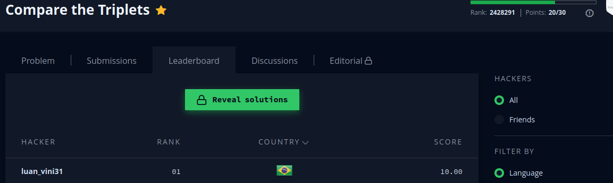

```javascript

function compareTriplets(a, b) {

    let result = [],
    alice  = 0,
    bob    = 0,
    score  = 0;
    
   for ( score ; score <= a.length ; score++)
   {
       if ( a[score] > b[score] )
       {
           alice ++
       }
       else if ( b[score] > a[score])
       {
           bob ++
       }
       else
       { 
           continue /* caso um array tenha mais indices que o outro, estou desconsiderando os indices a mais */
       }
   }
   
    result.push(alice, bob)
    return result
}


```

