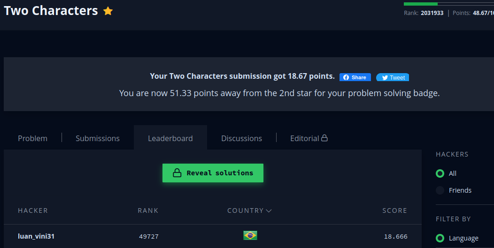

```javascript

function alternate(s) {
    let single = [],
    pairs = [],
    combinations = [],
    result = 0;

/* Remove valores duplicados */
for (let i = 0; i < s.length; i++)
 {
    if (!single.includes(s[i])) {
        single.push(s[i]);
    }
}

/* Separa as letras em pares*/
for (let i = 0; i < single.length; i++)
{
    for (let j = i + 1; j < single.length; j++) 
    {
        pairs.push(single[i].concat(single[j]));
    }
}

/* Verifica o maior valor possivel */
for (let i = 0; i < pairs.length; i++) 
{

    for (let j = 0; j < s.length; j++) 
    {
        if (pairs[i].includes(s[j]))
         {
         if (combinations.length > 0 && combinations[combinations.length - 1] === s[j]) 
            {
                combinations = []; 
                break; /* limpa o array caso forme uma string com caracteres repetidos em sequencia */
            }

        combinations.push(s[j]);
        }
}
    result = combinations.length > result ? combinations.length : result;
}

return result;
    
}
```

